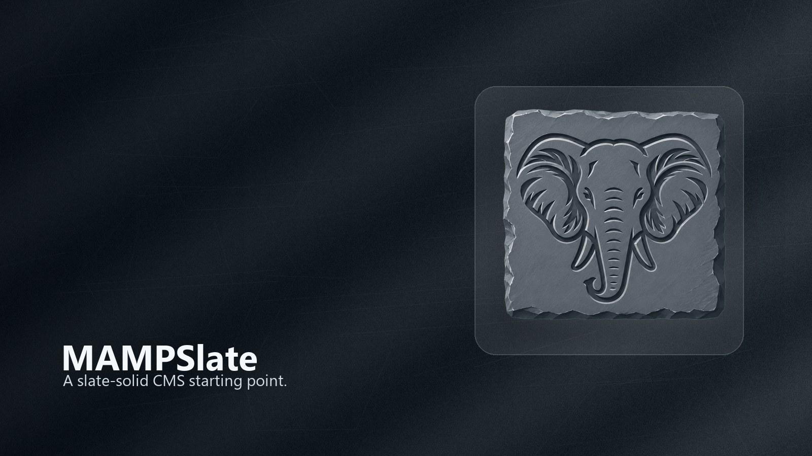

<p align="center">
  
</p>

# MAMPSlate CMS

A small, dependency-free PHP/MySQL base CMS for MAMP/LAMP. Designed to be copied
into a new project and specialized, not forked. Server-rendered pages, PDO
repositories, capability-based authorization, Markdown content, and
SEO-friendly extensionless URLs provide a safe foundation for customization.

<p align="center">
  
</p>

See [`docs/`](docs/README.md) for full documentation, starting with
[System Requirements](docs/requirements.md) and the
[Deployment Checklist](docs/deployment-checklist.md).

## Stack

- PHP 8.2+ (pdo_mysql, mbstring required; gd and curl conditionally)
- MySQL 5.7+ / MariaDB 10.4+ (SQL targets MySQL 5.7)
- Apache 2.4 with `mod_rewrite`

## Quick start (MAMP)

1. Point the document root at `public_html/`.
2. Visit `http://localhost/`; the first-run wizard opens if the database is not
   configured.
3. Create the site-master password, configure MySQL, initialize the schema, and
   create the administrator account.
4. Sign in, visit `/admin/getting-started`, and complete the launch checklist.

For a manual install, create the database and a least-privilege MySQL user,
apply `sql_init/001` through `022`, then copy `config/config.example.php` to
`config/config.local.php` with the required credentials.

## Layout

```
public_html/   document root (routes, assets, uploads)
includes/      bootstrap, repositories, auth, renderers (not web-accessible)
config/        local config and secrets (not web-accessible)
sql_init/      schema, seed, and migration scripts
modules/       optional local module manifests
docs/          specifications and operating notes
```

## Features

- Capability-based roles, modal auth, signup modes, and Google/GitHub OAuth
- Articles, pages, listings, Markdown, revisions, menus, media, comments, and SEO
- Generic custom fields, relationships, nested taxonomies, managed links,
  allowlisted embeds, collections, workflow states, and scheduling
- Theme/branding settings: logo, color, font, homepage ordering, footer, and social links
- Optional documents/audio/video, notifications, opt-in signed webhooks,
  privacy-friendly outbound click analytics, and accessibility checks
- Public/admin search filters, modular sitemap registry, backup/export tooling,
  API v1, MCP management, and operation dashboards
- Local module manifests, a subsystem scaffold command, and generated OpenAPI route inventory

Run `php tools/verify.php` before handoff. Use `php tools/make_subsystem.php
<name> --dry-run` before starting a project-specific subsystem.
